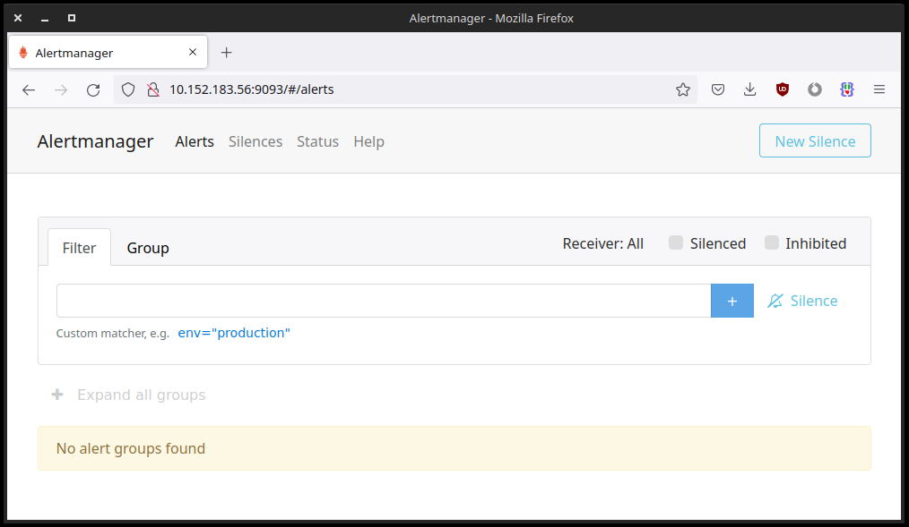

# Alertmanager Operator (k8s)
[](https://charmhub.io/alertmanager-k8s)
[](https://github.com/canonical/alertmanager-k8s-operator/actions/workflows/release-edge.yaml)


[Charmed Alertmanager (alertmanager-k8s)][Alertmanager operator] is a charm for
[Alertmanager].

The charm imposes configurable resource limits on the workload, can be readily
integrated with alert sources such as [prometheus][Prometheus operator] or
[loki][Loki operator], and comes with built-in alert rules and dashboards for
self-monitoring.

It is an essential part of the [COS Lite bundle].


[Alertmanager]: https://prometheus.io/docs/alerting/latest/alertmanager/
[COS Lite bundle]: https://charmhub.io/cos-lite
[Loki operator]: https://charmhub.io/loki-k8s
[Prometheus operator]: https://charmhub.io/prometheus-k8s
[Alertmanager operator]: https://charmhub.io/alertmanager-k8s


## Getting started

### Basic deployment

Once you have a controller and model ready, you can deploy alertmanager
using the Juju CLI:

```shell
juju deploy --channel=beta alertmanager-k8s
```

The available [channels](https://snapcraft.io/docs/channels) are listed at the top
of [the page](https://charmhub.io/alertmanager-k8s) and can also be retrieved with
Charmcraft CLI:

```shell
$ charmcraft status alertmanager-k8s

Track    Base                  Channel    Version    Revision    Resources
latest   ubuntu 20.04 (amd64)  stable     -          -           -
                               candidate  -          -           -
                               beta       9          9           alertmanager-image (r1)
                               edge       9          9           alertmanager-image (r1)
```

Once the Charmed Operator is deployed, the status can be checked by running:

```shell
juju status --relations --storage --color
```


### Configuration

In order to have alerts dispatched to your receiver(s) of choice,
a [configuration file](https://www.prometheus.io/docs/alerting/latest/configuration/)
must be provided to Alertmanager using the
[`config_file`](https://charmhub.io/alertmanager-k8s/configure#config_file) option:

```shell
juju config alertmanager-k8s \
  config_file='@path/to/alertmanager.yml'
```

Note that if you use templates, you should use the `templates_file` config option
instead of having a `templates` section in your `yaml` configuration file.
(This is a slight deviation from the official alertmanager config spec.)


Use the [`templates_file`](https://charmhub.io/alertmanager-k8s/configure#templates_file)
option to push templates that are being used by the configuration file:

```shell
juju config alertmanager-k8s \
  config_file='@path/to/alertmanager.yml' \
  templates_file='@path/to/templates.tmpl'
```

All templates need to go into this single config option, instead of
the 'templates' section of the main configuration file. The templates will be
pushed to the workload container, and the configuration file will be updated
accordingly.

Refer to the
[official templates documentation](https://prometheus.io/docs/alerting/latest/notification_examples/)
for more details.


To verify Alertmanager is using the expected configuration you can use the
[`show-config`](https://charmhub.io/alertmanager-k8s/actions#show-config) action:

```shell
juju run-action alertmanager-k8s/0 show-config --wait
```


### Dashboard and HTTP API

The Alertmanager dashboard and
[HTTP API](https://www.prometheus.io/docs/alerting/latest/management_api/)
can be accessed at the default port (9093) on the Alertmanager IP address,
which is determinable with a `juju status` command.

To obtain the load-balanaced application IP,

```shell
juju status alertmanager-k8s --format=json \
  | jq -r '.applications."alertmanager-k8s".address'
```

Similarly, to obtain an individual unit's IP address:

```shell
juju status alertmanager-k8s --format=json \
  | jq -r '.applications."alertmanager-k8s".units."alertmanager-k8s/0".address'
```

So, if you navigate to these IPs you will get the Alertmanager dashboard:




## Clustering

### Forming a cluster

Alertmanager [supports clustering](https://www.prometheus.io/docs/alerting/latest/alertmanager/#high-availability)
and all you need to do to create/update a cluster is to rescale the application. This can be done in two ways.

Let's say we have one alertmanager unit running and we want to scale the deployment to three units.

With `juju add-unit` we can achieve that using the `--num-units` argument and the number of units we want to add:

```shell
juju add-unit alertmanager-k8s --num-units 2
```

or using `juju scale-application` and the total number of units we want:

```shell
juju scale-application alertmanager-k8s 3
```

Regardless of which of the two options you use, `juju status --relations --color` will show you the status of the cluster.


Internally, HA is achieved by providing each Alertmanager instance at least one IP address of another instance. The cluster would then auto-update with subsequent changes to the units present.

### Verification


#### Pebble plan
Cluster information is passed to Alertmanager via [`--cluster.peer` command line arguments](https://github.com/prometheus/alertmanager#high-availability). This can be verified by looking at the current pebble plan:

```shell
> juju exec --unit alertmanager-k8s/0 -- \
  PEBBLE_SOCKET=/charm/containers/alertmanager/pebble.socket \
  pebble plan

services:
    alertmanager:
        summary: alertmanager service
        startup: enabled
        override: replace
        command: alertmanager --config.file=/etc/alertmanager/alertmanager.yml --storage.path=/alertmanager --web.listen-address=:9093 --cluster.listen-address=0.0.0.0:9094 --cluster.peer=10.1.179.220:9094 --cluster.peer=10.1.179.221:9094
```
#### HTTP API
To manually verify a cluster is indeed formed, you can query the alertmanager HTTP API directly:

```shell
> curl -s $ALERTMANAGER_IP:9093/api/v1/status \
  | jq '.data.clusterStatus.peers[].address'
"10.1.179.220:9094"
"10.1.179.221:9094"
"10.1.179.217:9094"
```


## OCI Images
This charm is published on Charmhub with alertmanager images from
[ubuntu/prometheus-alertmanager], however, it should also work with the
official [quay.io/prometheus/alertmanager].

To try the charm with a different image you can use `juju refresh`. For example:

```shell
juju refresh alertmanager-k8s \
  --resource alertmanager-image=quay.io/prometheus/alertmanager
```


[ubuntu/prometheus-alertmanager]: https://hub.docker.com/r/ubuntu/prometheus-alertmanager
[quay.io/prometheus/alertmanager]: https://quay.io/repository/prometheus/alertmanager?tab=tags


## Official alertmanager documentation

For further details about Alertmanager configuration and usage, please refer to
the [official Alertmanager documentation](https://www.prometheus.io/docs/alerting/latest/overview/).


## Additional Information
- [Logging, Monitoring, and Alerting](https://discourse.ubuntu.com/t/logging-monitoring-and-alerting/19151) (LMA) -
  a tutorial for running Prometheus, Grafana and Alertmanager with LXD.
- [Alertmanager README](https://github.com/prometheus/alertmanager)
- [PromCon 2018: Life of an Alert](https://youtube.com/watch?v=PUdjca23Qa4)
